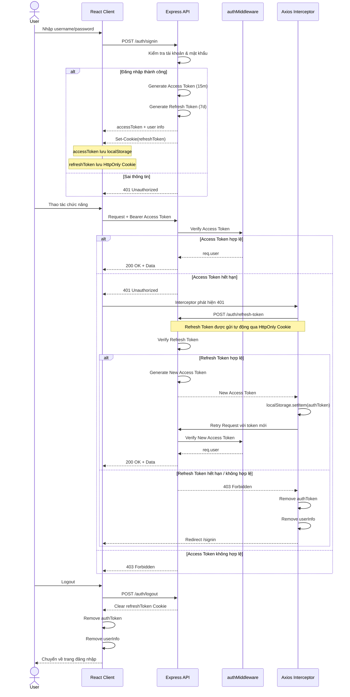
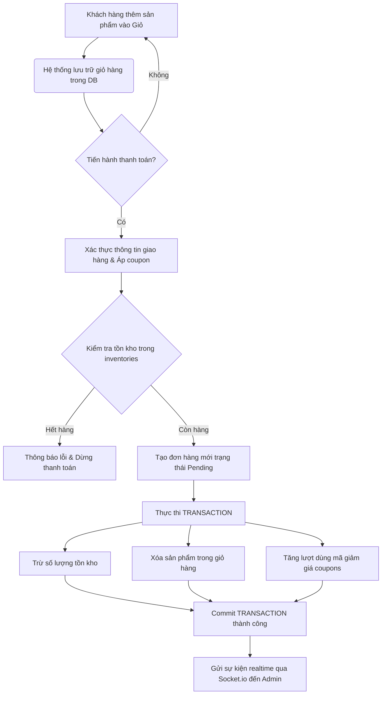

# 🖥️ TechZone


> Hệ thống thương mại điện tử chuyên kinh doanh thiết bị công nghệ.
>
> _Ngôn ngữ phát triển:_ JavaScript (ES6+), ReactJS 19, NodeJS (ExpressJS), MySQL.

---

## 📑 Mục lục

1. [Mô Tả Dự Án & Mục Tiêu](#1-mô-tả-dự-án--mục-tiêu)
2. [Kiến Trúc Tổng Thể & Công Nghệ Sử Dụng](#2-kiến-trúc-tổng-thể--công-nghệ-sử-dụng)
3. [Sơ Đồ Hệ Thống & Luồng Dữ Liệu (Mermaid)](#3-sơ-đồ-hệ-thống--luồng-dữ-liệu-mermaid)
4. [Giao Diện Ứng Dụng](#4-giao-diện-ứng-dụng)
5. [Cấu Trúc Thư Mục Chi Tiết](#5-cấu-trúc-thư-mục-chi-tiết)
6. [Hướng Dẫn Cấu Hình Môi Trường](#6-hướng-dẫn-cấu-hình-môi-trường)
7. [Hướng Dẫn Cài Đặt & Vận Hành Local](#7-hướng-dẫn-cài-đặt--vận-hành-local)

---

## 1. Mô Tả Dự Án & Mục Tiêu

### 1.1. Giới thiệu dự án

**TechZone** là hệ thống thương mại điện tử (E-commerce) chuyên biệt dành cho các thiết bị công nghệ cao (Điện thoại di động, Laptop, Linh kiện, Phụ kiện thông minh). Hệ thống được thiết kế theo mô hình **SPA (Single Page Application)** kết hợp với **RESTful API** và tương tác thời gian thực (**Real-time updates**).

### 1.2. Mục tiêu dự án

- **Tối ưu hóa trải nghiệm khách hàng:** Tìm kiếm thông minh, bộ lọc động theo thông số kỹ thuật (RAM, bộ nhớ, màu sắc), giỏ hàng nhất quán, quản lý sổ địa chỉ giao hàng và quy trình thanh toán nhanh chóng.
- **Hỗ trợ quản trị viên toàn diện:** Dashboard trực quan, hiển thị doanh thu thực tế, thống kê đơn hàng, quản lý kho hàng tự động dựa trên giao dịch, quản lý sản phẩm đa biến thể và phân quyền linh hoạt.
- **Khả năng mở rộng tốt (Scalability):** Tách biệt hoàn toàn Frontend (Vite/React) và Backend (Node/Express). Sử dụng kiến trúc 3 lớp (3-Tier Layered Architecture) chuẩn chỉ cho phép nâng cấp độc lập và dễ dàng tích hợp các cổng thanh toán bên thứ ba trong tương lai.

---

## 2. Kiến Trúc Tổng Thể & Công Nghệ Sử Dụng

Hệ thống được thiết kế theo mô hình **Client-Server** phi trạng thái (Stateless REST API), tích hợp Socket.io cho kết nối song hướng thời gian thực.

```
+--------------------------------------------------------+
|                      User Browser                      |
|  [React 19 SPA / Tailwind CSS / Socket.io-Client]      |
+---------------------------+----------------------------+
                            | (HTTP Requests / WebSockets)
                            v
+--------------------------------------------------------+
|                     API Gateway                        |
|  [Express Router / CORS / Auth & Role Middleware]      |
+---------------------------+----------------------------+
                            |
                            v
+--------------------------------------------------------+
|                   Backend Services                     |
|  [Controller Layer -> Service Layer -> Model Layer]    |
+------------------+-----------------+-------------------+
                   |                 |
                   v                 v
+--------------------+     +--------------------+
|   MySQL Database   |     | Cloudinary Service |
| (Aiven Cloud Pool) |     |  (Lưu trữ hình ảnh)|
+--------------------+     +--------------------+
```

## Tech Stack

### Frontend

- React 19
- React Router v7
- Vite (Rolldown-Vite)
- Tailwind CSS 3.x
- Recharts
- Socket.io-client
- Axios

### Backend

- Node.js
- Express.js 5.x
- MySQL2
- JSON Web Token (JWT)
- Bcrypt
- Bcryptjs
- Multer
- Cloudinary
- Socket.io

### Database

- MySQL

### Authentication & Security

- JWT (Access Token & Refresh Token)
- Bcrypt
- Bcryptjs

### File Storage & Upload

- Multer
- Cloudinary

### Real-time Communication

- Socket.io
- Socket.io-client

### Development Tools

- Vite
- npm
- Git
- GitHub

---

## 3. Sơ Đồ Hệ Thống & Luồng Dữ Liệu (Mermaid)

### 3.1. Sơ đồ luồng xác thực và Auto-Refresh Token

Sơ đồ dưới đây biểu diễn cơ chế tự động gia hạn token (Silent Refresh) giúp nâng cao trải nghiệm người dùng mà không làm ngắt quãng phiên làm việc:



### 3.2. Sơ đồ luồng đặt hàng & Cập nhật kho hàng tự động

Mô tả quy trình nghiệp vụ mua sắm từ Giỏ hàng -> Đặt hàng -> Cập nhật kho:



---

## 4. Giao Diện Ứng Dụng

Hệ thống sở hữu giao diện trực quan, hiện đại và hoàn toàn responsive, hỗ trợ trải nghiệm tối ưu trên cả thiết bị di động lẫn máy tính để bàn.

### 4.1. Giao diện khách hàng (Client UI)

- **Trang chủ (Home)**


Hiển thị danh mục công nghệ nổi bật, sản phẩm bán chạy, sản phẩm mới và banner khuyến mãi động.

- **Chi tiết sản phẩm (Details)**


Xem thông số kỹ thuật chi tiết (RAM, bộ nhớ, màu sắc), xem hình ảnh chất lượng cao và đánh giá từ khách hàng khác.

- **Giỏ hàng **


- **Dặt Hàng:**


### 4.2. Giao diện quản trị

- **Thống kê tổng quan**


Biểu đồ doanh thu trực quan, thống kê đơn hàng và lượng người dùng hoạt động theo thời gian thực (real-time).

- **Quản lý danh mục & Sản phẩm**


Giao diện thêm/sửa/xóa sản phẩm đa biến thể trực quan, tích hợp upload ảnh trực tiếp lên Cloudinary.

- **Quản lý đơn hàng & Kho hàng**


Theo dõi tình trạng các đơn hàng, cập nhật số lượng tồn kho tự động.

---

## 5. Cấu Trúc Thư Mục Chi Tiết

Dự án được cấu trúc rõ ràng nhằm phân chia rách nhiệm (Separation of Concerns):

### 5.1. Backend Directory Structure

```text
backend/
├── src/
│   ├── config/             # Cấu hình kết nối hệ thống (Database, Cloudinary...)
│   │   └── db.js           # Kết nối MySQL Pool (sử dụng mysql2/promise)
│   ├── controllers/        # Điều hướng yêu cầu, xử lý Request/Response HTTP
│   │   ├── authController.js
│   │   ├── productController.js
│   │   ├── cartController.js
│   │   ├── orderController.js
│   │   └── ...
│   ├── middlewares/        # Bộ lọc trung gian xử lý nghiệp vụ chung
│   │   ├── authMiddleware.js    # Xác thực Access Token JWT
│   │   ├── roleMiddleware.js    # Phân quyền dựa trên vai trò người dùng (roles)
│   │   └── uploadMiddleware.js  # Tích hợp Multer và Cloudinary Storage
│   ├── models/             # Định nghĩa truy vấn SQL trực tiếp tới CSDL
│   │   ├── productModel.js
│   │   ├── userModel.js
│   │   ├── orderModel.js
│   │   └── ...
│   ├── services/           # Lớp chứa Business Logic cốt lõi của ứng dụng
│   │   ├── productService.js
│   │   ├── orderService.js
│   │   └── ...
│   └── routes/             # Định nghĩa các điểm cuối API (Endpoints)
│       ├── authRoutes.js
│       ├── productRoutes.js
│       └── ...
├── .env                    # Lưu trữ biến môi trường cục bộ
├── ecosystem.config.js     # Tập tin cấu hình quản lý tiến trình bằng PM2
├── server.js               # Điểm khởi chạy chính của Server, khởi tạo Socket.io
└── package.json            # Quản lý dependencies và scripts backend
```

### 5.2. Frontend Directory Structure

```text
frontend/
├── public/                 # Các tài nguyên tĩnh (logo, favicon...)
├── src/
│   ├── api/                # Cấu hình Axios client và các hàm gọi API chuyên biệt
│   │   ├── api.js          # Khởi tạo Axios Instance kèm Interceptors
│   │   ├── authApi.js
│   │   ├── productApi.js
│   │   └── ...
│   ├── Components/         # Các thành phần giao diện dùng chung (Reusable Components)
│   │   ├── Header.jsx
│   │   ├── ProductCard.jsx
│   │   ├── admin/          # Thành phần dành riêng cho giao diện Admin
│   │   └── ...
│   ├── Pages/              # Các trang giao diện chính (Views)
│   │   ├── Home.jsx
│   │   ├── Details.jsx
│   │   ├── Admin.jsx       # Trang quản lý tổng quan cho quản trị viên
│   │   ├── ShoppingCart.jsx
│   │   ├── Payment.jsx
│   │   └── ...
│   ├── App.jsx             # Nơi khai báo định tuyến chính (React Router Layouts)
│   ├── index.css           # Cấu hình Tailwind CSS imports
│   ├── main.jsx            # Entry point của ứng dụng React
│   └── ProtectedRoute.jsx  # Bảo vệ các route yêu cầu đăng nhập/phân quyền
├── .env                    # Biến môi trường frontend (API Base URL...)
├── tailwind.config.js      # Cấu hình hệ màu và tùy chỉnh Tailwind
├── vite.config.js          # Cấu hình bundler Vite
└── package.json            # Quản lý dependencies và scripts frontend
```

---

## 6. Hướng Dẫn Cấu Hình Môi Trường

Trước khi vận hành hệ thống, hãy tạo các tập tin `.env` ở cả hai thư mục Backend và Frontend với định dạng bên dưới.

### 6.1. Cấu hình Backend (`backend/.env`)

```env
# Cấu hình Cổng Chạy API Server
PORT=8081
NODE_ENV=production

# Khóa Bảo Mật JWT (Hãy thay đổi thành chuỗi hash dài và phức tạp ở production)
JWT_ACCESS_SECRET=YOUR_ACCESS_SECRET
JWT_REFRESH_SECRET=YOUR_REFRESH_SECRET

# Cấu hình Kết nối MySQL Database Pool
DB_HOST=YOUR_DB_HOST
DB_PORT=YOUR_DB_PORT
DB_USER=YOUR_DB_USER
DB_PASSWORD=YOUR_DB_PASSWORD
DB_NAME=YOUR_DB_NAME
```

### 6.2. Cấu hình Frontend (`frontend/.env`)

```env
# Địa chỉ URL của API Server Backend
VITE_API_BASE_URL=http://localhost:8081/api

# Địa chỉ URL của Client App Frontend
VITE_BASE_URL=http://localhost:5173
```

---

## 7. Hướng Dẫn Cài Đặt & Vận Hành Local

Làm theo thứ tự các bước dưới đây để thiết lập dự án trên môi trường phát triển cục bộ:

### Bước 1: Khởi tạo Database

1.  Đảm bảo máy tính đã cài đặt MySQL Server phiên bản >= 8.0.
2.  Mở CLI hoặc phần mềm quản lý DB (như DBeaver, Navicat) và thực thi mã SQL trong tệp tin `database/database.sql` để tạo cấu trúc bảng.

### Bước 2: Cài đặt và Chạy Backend

1.  Di chuyển vào thư mục backend:
    ```bash
    cd backend
    ```
2.  Cài đặt tất cả các package phụ thuộc:
    ```bash
    npm install
    ```
3.  Khởi chạy Server ở chế độ nhà phát triển (Development mode):
    ```bash
    npm run dev
    ```
    Server sẽ lắng nghe tại địa chỉ: `http://localhost:8081`

### Bước 3: Cài đặt và Chạy Frontend

1.  Mở một cửa sổ terminal mới và di chuyển tới thư mục frontend:
    ```bash
    cd frontend
    ```
2.  Cài đặt các package phụ thuộc:
    ```bash
    npm install
    ```
3.  Khởi chạy ứng dụng React SPA bằng Vite:
    ```bash
    npm run dev
    ```
    Truy cập giao diện tại: `http://localhost:5173`

---
